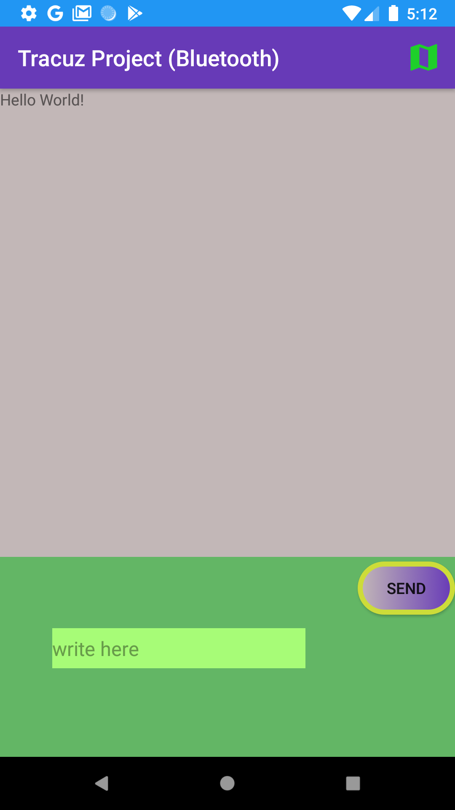
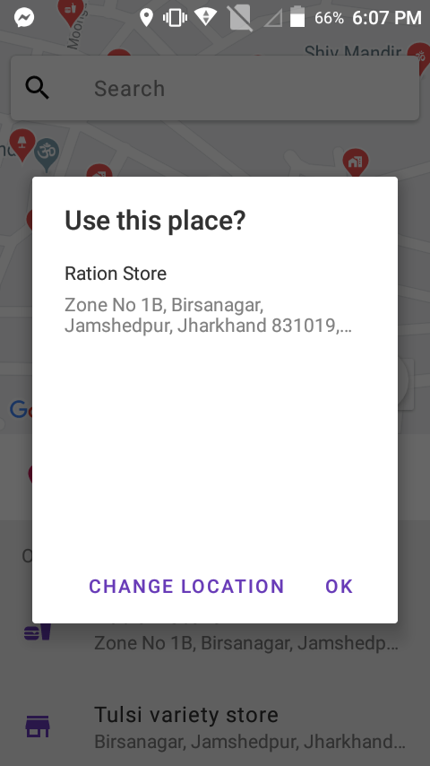
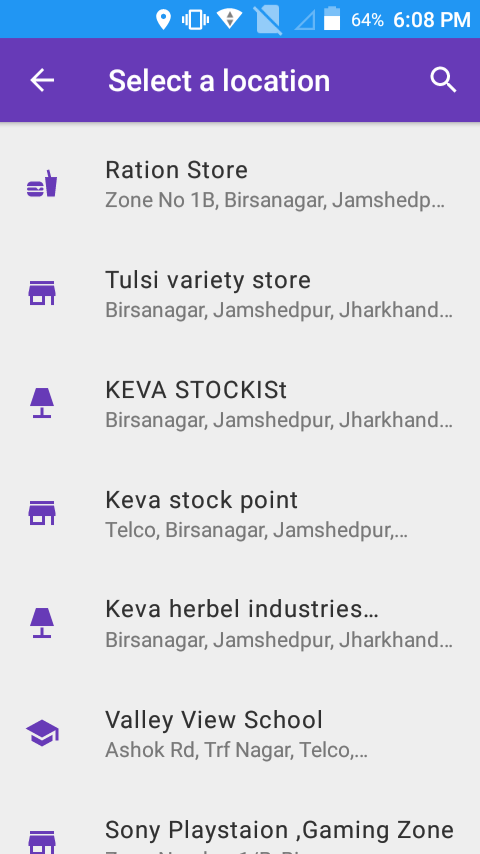
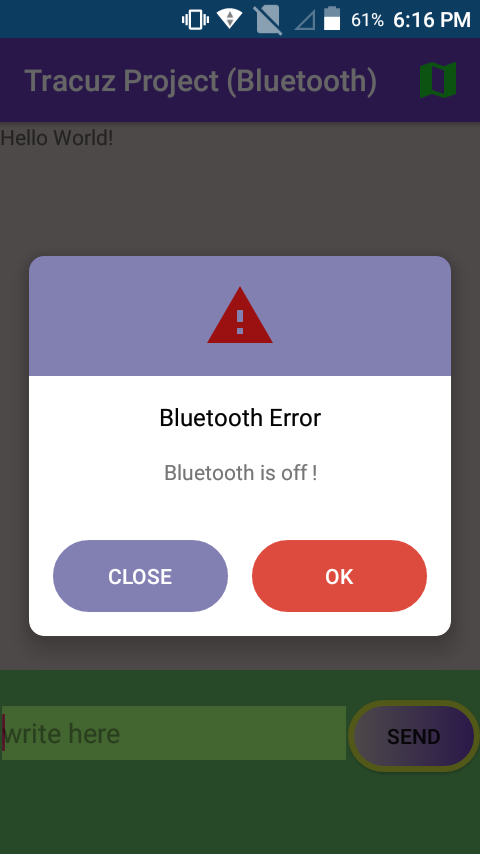
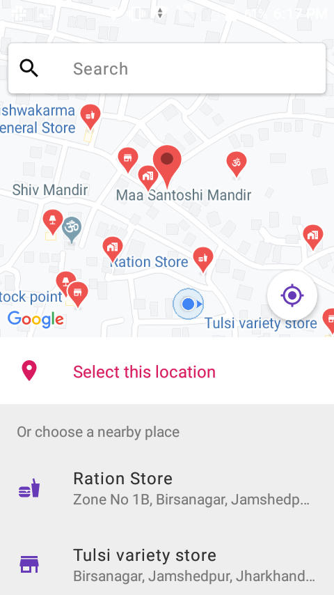

<html>
<head>
  <h1> Tracuz Bluetooth app hiring challenge Project. </h1>
  </head>
<body>
<h4> Project Description </h4>
<ul>
  <li> Two mobile devices need to be connected in order to establish the client and server connectiion using Bluetooth Server Scocket and Bluetooth Scocket.</li>
  <li> For more details regarding bluetooth socket and connection visit <a href="https://developer.android.com/reference/android/bluetooth/BluetoothSocket">More about BloothSocket</a>. </li>
    <li> I have also added a google map functionality to innovate the application. Where the current user can view the nearby important and amazing places to visit by clicking the map icon on right corner of menu bar. </li>
  <li> If no blutooth devices found then an error dialog will be displayed.</li>
  <li> On the map user can get all the amazing places nearby location to visit using the location api. Images as shown below for better understanding. </li> 
  <ul>
 

  
  
  
  
 
    

 
 </body>
 </html>
